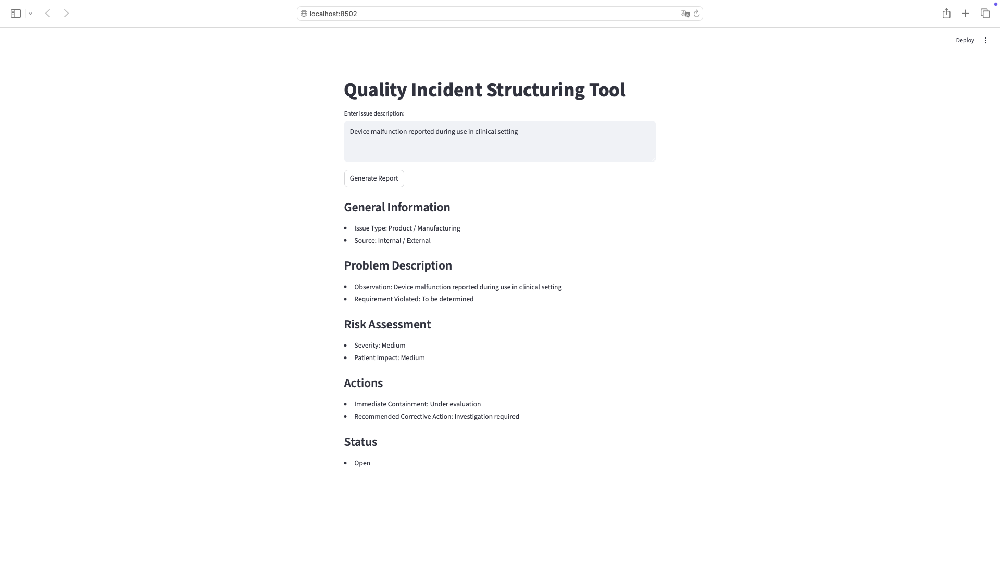

Requires Python 3.9+

# Quality Incident Structuring Tool

A simple AI-assisted tool to convert unstructured quality issues into structured reports, inspired by workflows in medical device and healthcare environments.

## 🔍 Problem
Quality incidents are often written in unstructured formats, making tracking, reporting, and decision-making inefficient.

## 💡 Solution
This tool converts raw issue descriptions into structured reports with:
- Issue classification (Manufacturing, Logistics, Packaging, etc.)
- Problem description
- Risk assessment
- Suggested actions

## ⚙️ Tech Stack
- Python
- Streamlit

## 🧪 Example

## 📸 App Demo


**Input:**
Device malfunction reported during use in clinical setting

**Output:**
Structured report with issue type, severity, and recommended actions

## 🚀 How to Run

1. Clone the repository:
```bash
git clone https://github.com/haripriyakrishnan61-hash/quality-incident-structuring-v1.git
cd quality-incident-structuring-v1
```

2. Install dependencies:
```bash
pip install streamlit
```

3. Run the app:
```bash
streamlit run app.py
```
